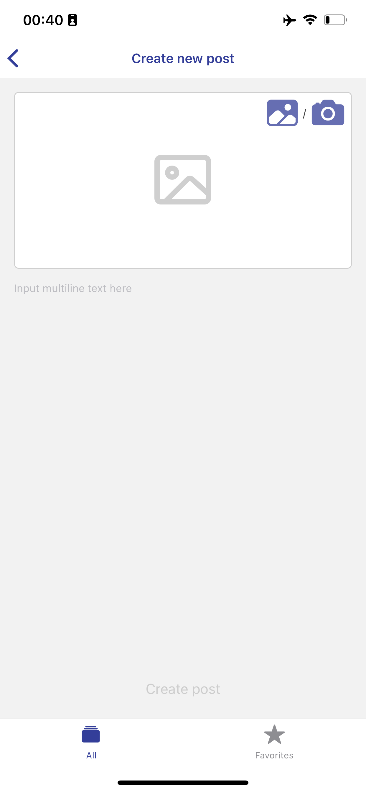
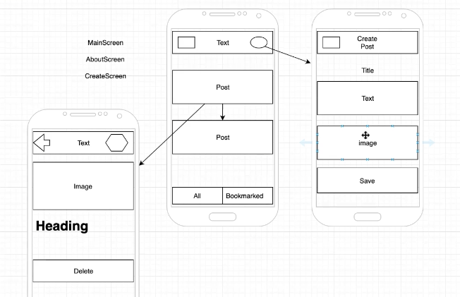

# rn-local-blog

|  |  |

Prototype:

|  |

 

### How to build project

⚽️ Prepare expo environment by https://docs.expo.dev/get-started/installation/

⚽️ `npm install` or `npm install --force` (if needed workaround)

⚽️ ⚠️ `yarn patch-package`️ (one more workaround)

⚽️ `expo start` or `npm start`

⚽️ Install Expo app to mobile phone.

⚽️ Scan the QR code above with Expo Go (Android) or the Camera app (iOS)

 

### Upgrading Expo SDK

https://docs.expo.dev/workflow/upgrading-expo-sdk-walkthrough/

`npm i -g expo-cli`

`expo upgrade`

 

### Notes

⚠️ This course example use legacy React Navigation V4. Be careful when updating Expo SDK.

Because new Expo SDK require to update dependencies, but some legacy React Navigation V4 modules were frozen and legacy dependencies too.

 

#### ReactNavigation V4 'react-navigation-drawer' legacy component issue

It used old dependency versions of 'react-native-reanimated' and 'react-native-gesture-handler'.

To fix 'react-native-gesture-handler' — `npm install --force`

To fix 'react-native-reanimated' — `yarn patch-package`

 

⚠️ TypeError: interpolate is not a function. How to fix: `yarn patch-package`️. Explanation:

This error, because 'react-native-reanimated' was updated together with Expo SDK v45.

And 'react-navigation-drawer' component still used old previous 'react-native-reanimated' API.

We need to patch 'react-navigation-drawer' to use new 'interpolateNode' method instead of 'interpolate'.

https://stackoverflow.com/questions/67840220/getting-typeerror-interpolate-is-not-a-function-in-react-native

> 'I also faced this issue and you don't have to downgrade your react-native-reanimated.
In the latest versions of reanimated, interpolate was changed to interpolateNode. 
So all you have to do is to open the Drawer.js file found in:'
'node_modules\react-navigation-drawer\lib\module\views and replace interpolate with interpolateNode. 
It is in two places, so make sure you change both of them.'

 

⚠️ Used `yarn patch-package` instead `npx patch-package`

Because yarn works out-of-the-box, after npx you can see error:

> sh: patch-package: command not found

add ./node_modules/.bin to your $PATH environment variable

https://github.com/ds300/patch-package/issues/14

### Сourse author

@Vladilen Minin 
https://www.udemy.com/course/react-native-complete-guide/